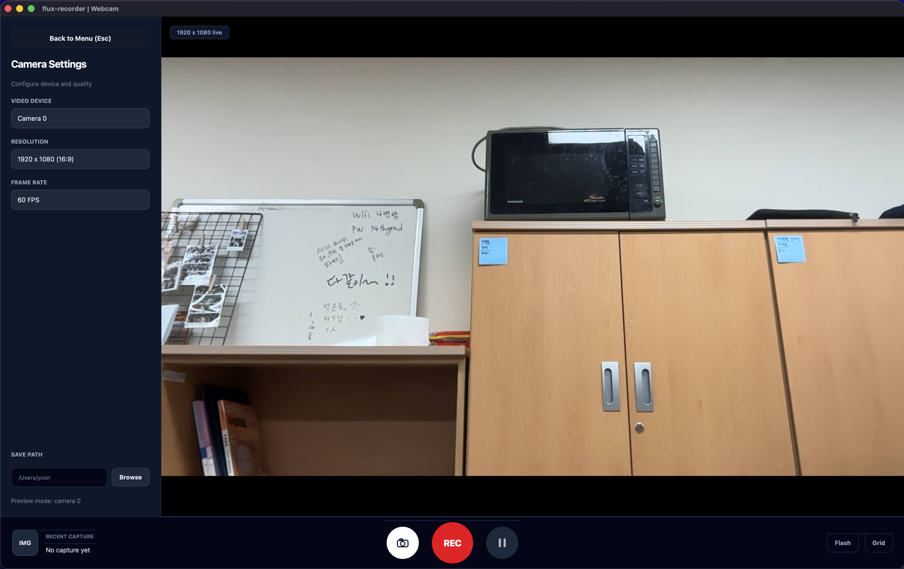
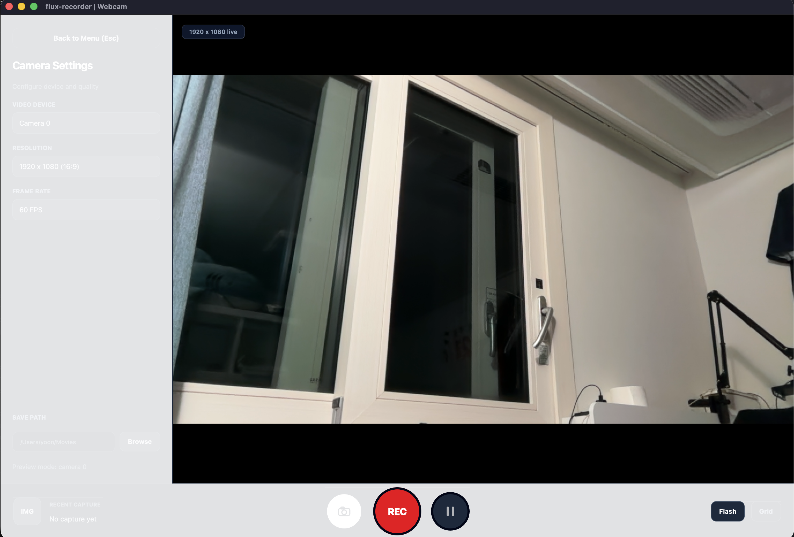
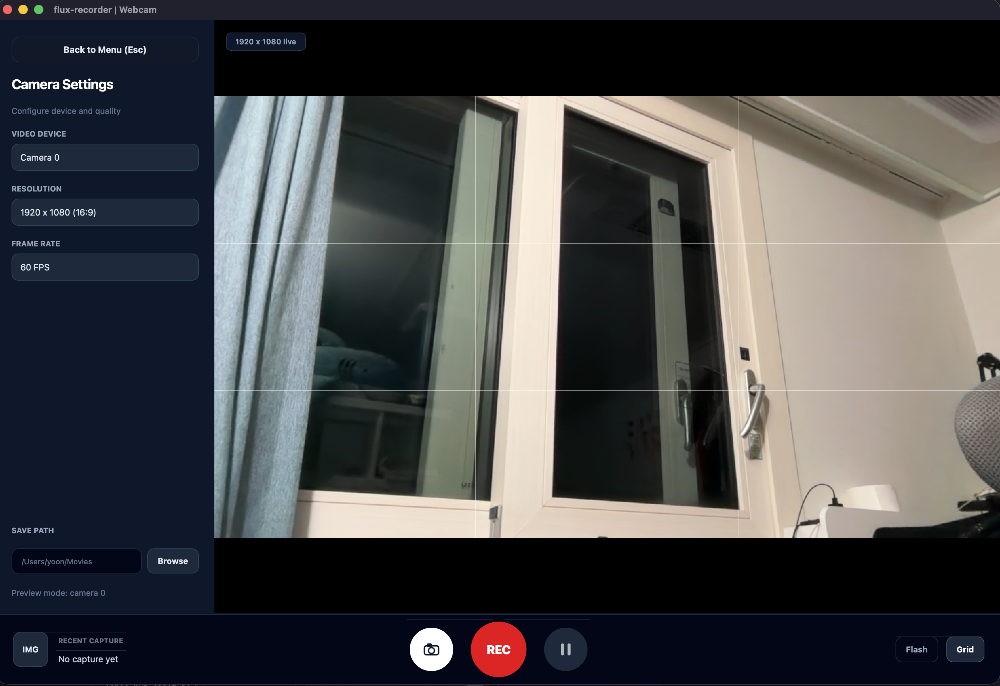
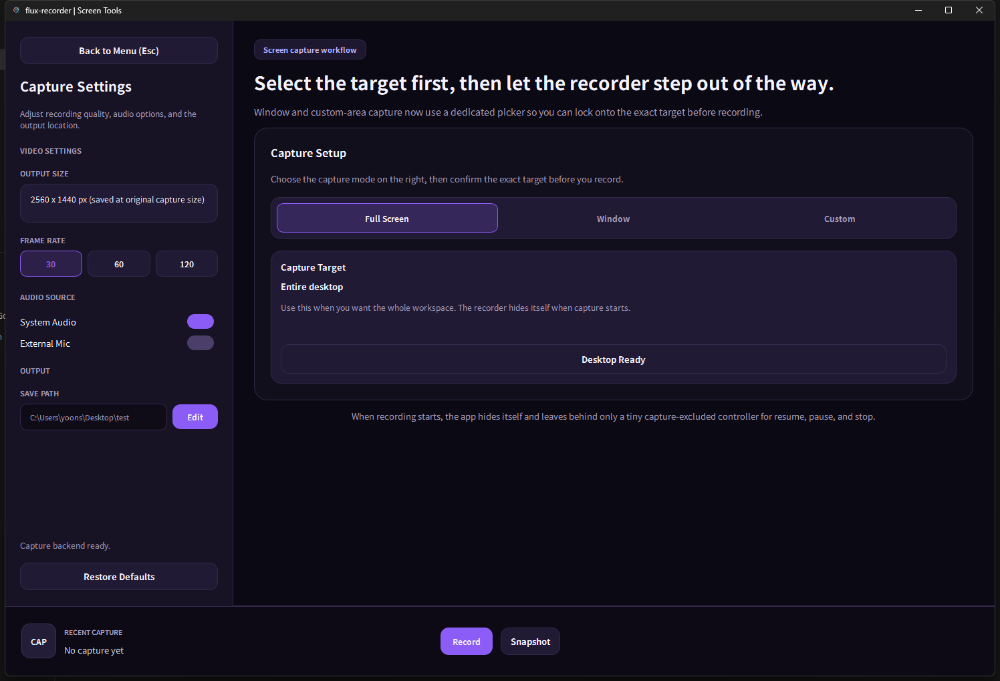
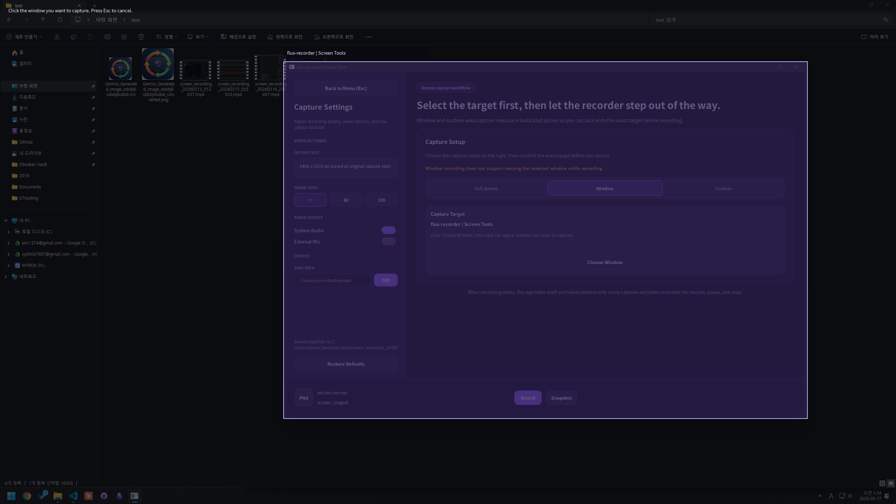
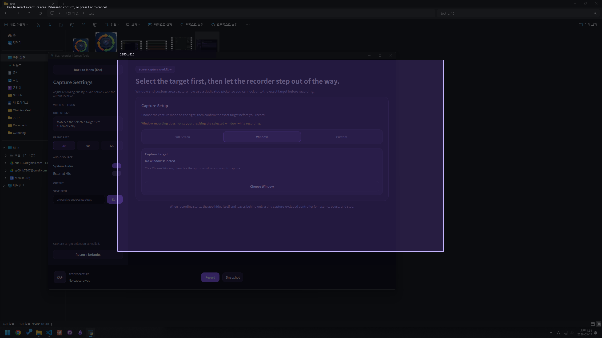
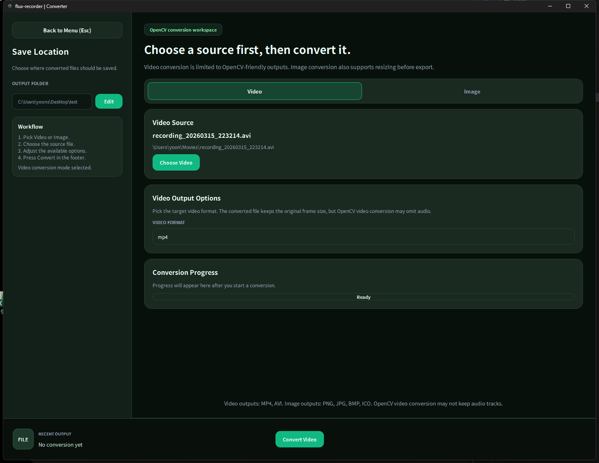
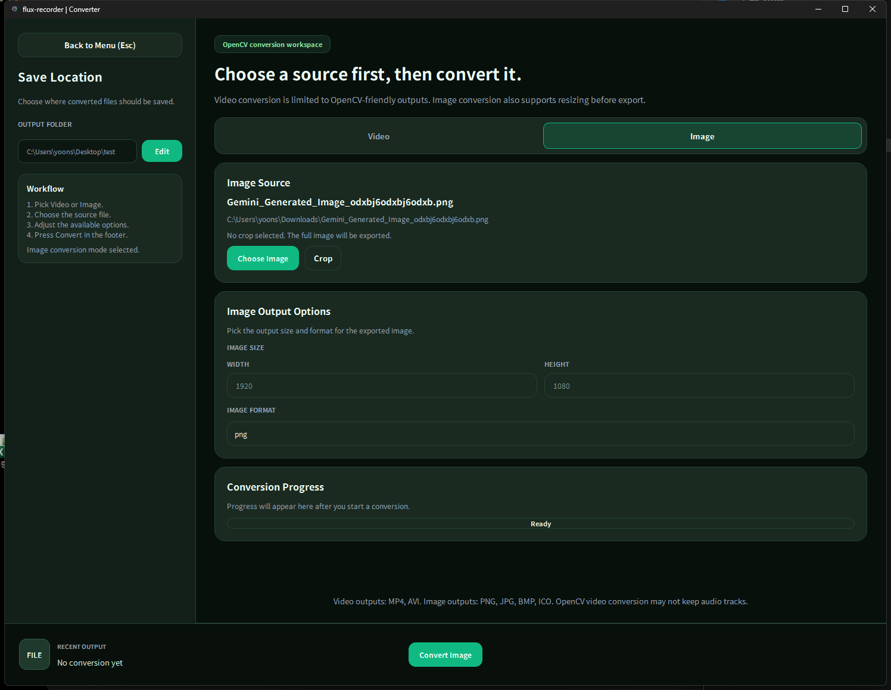
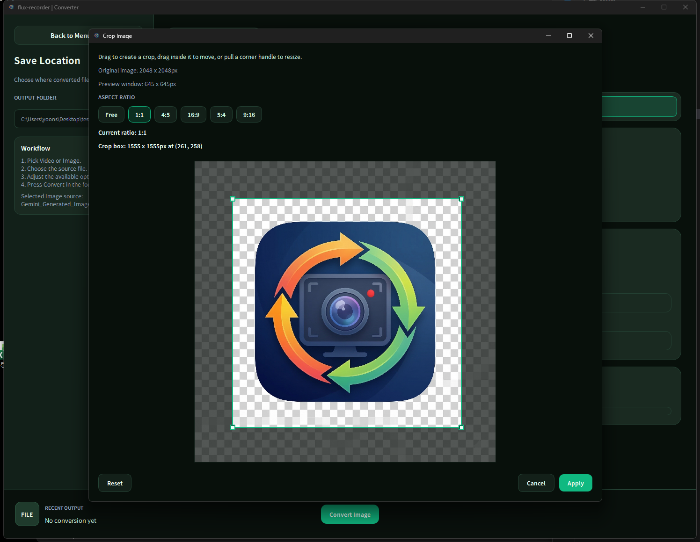

# flux-recorder

Desktop media toolkit built with `PyQt6` and `OpenCV`.

Korean version: [readme_kr.md](readme_kr.md)

It currently includes:
- Webcam recording
- Screen recording
- Image and video conversion
- Image crop, resize, and format export controls in the converter

## App Screenshots

### Webcam Recorder

<table>
  <tr>
    <td align="center" width="50%">
      <a href="images/webcam-recorder-default.png"></a><br>
      <sub><strong>Webcam Recorder</strong>: Default webcam preview and recording controls.</sub>
    </td>
    <td align="center" width="50%">
      <a href="images/webcam-recorder-flash.png"></a><br>
      <sub><strong>Webcam Recorder</strong>: Flash capture workflow for still-image capture.</sub>
    </td>
  </tr>
  <tr>
    <td align="center" width="50%">
      <a href="images/webcam-recorder-grid.png"></a><br>
      <sub><strong>Webcam Recorder</strong>: Grid overlay option for framing and alignment.</sub>
    </td>
    <td></td>
  </tr>
</table>

### Screen Recorder

<table>
  <tr>
    <td align="center" width="50%">
      <a href="images/screen-recorder-overview.png"></a><br>
      <sub><strong>Screen Recorder</strong>: Overview of the capture setup workspace.</sub>
    </td>
    <td align="center" width="50%">
      <a href="images/screen-recorder-window.png"></a><br>
      <sub><strong>Screen Recorder</strong>: Window capture mode on Windows.</sub>
    </td>
  </tr>
  <tr>
    <td align="center" width="50%">
      <a href="images/screen-recorder-custom.png"></a><br>
      <sub><strong>Screen Recorder</strong>: Custom region selection workflow.</sub>
    </td>
    <td></td>
  </tr>
</table>

### File Converter

<table>
  <tr>
    <td align="center" width="50%">
      <a href="images/file-converter-video.png"></a><br>
      <sub><strong>Converter</strong>: Video format conversion workflow.</sub>
    </td>
    <td align="center" width="50%">
      <a href="images/file-converter-image.png"></a><br>
      <sub><strong>Converter</strong>: Image export, resize, and format conversion workflow.</sub>
    </td>
  </tr>
  <tr>
    <td align="center" width="50%">
      <a href="images/file-converter-crop.png"></a><br>
      <sub><strong>Converter</strong>: Image crop dialog used before export.</sub>
    </td>
    <td></td>
  </tr>
</table>

## Demo Videos

GitHub README renders local images inline, but local video files are shown most reliably as links.

### Webcam Recorder
- [Watch Webcam Recorder Demo](videos/webcam-recorder-total.mov)

### Screen Recorder
- [Watch Screen Recorder Demo](videos/screen-recorder-total.mp4)

### Converter
- [Watch Video Converter Demo](videos/file-converter-video.mp4)
- [Watch Image Converter Demo](videos/file-converter-image.mp4)

## Requirements

- Python 3.11+
- Windows recommended for the current screen capture workflow

## Install

```bash
pip install -r requirements.txt
```

## Run

```bash
python main.py
```

## Package With PyInstaller

Build on each target OS separately.

- Windows build on Windows
- macOS build on macOS

Install PyInstaller first:

```bash
pip install pyinstaller
```

Windows:

```bash
build\build_windows.bat
```

macOS:

```bash
bash build/build_mac.sh
```

Output is created in `dist/flux-recorder/`.

Notes:

- The project uses `flux-recorder.spec` for packaging.
- `assets/` is bundled automatically.
- Windows app icon uses `assets/app.ico`.
- macOS app icon uses `assets/app.icns` if you add one. If no `.icns` file is present, the app still builds without a custom macOS icon.

## Core Stack

- `PyQt6` for the desktop UI
- `OpenCV` for webcam capture, video writing, and core media handling
- `NumPy` for frame data handling
- `Pillow` for image crop application, resizing, and format conversion tasks

## Where OpenCV Is Used In Code

The project uses OpenCV directly in the following parts of the codebase:

- `core/camera.py`
  - Opens webcam devices with `cv2.VideoCapture`
  - Reads camera FPS with `cv2.CAP_PROP_FPS`
  - Converts camera frames from `BGR` to `RGB` with `cv2.cvtColor`

```python
class CameraCapture:
    def open(self) -> None:
        self._capture = cv2.VideoCapture(self._device_index)

    @property
    def fps(self) -> float:
        fps = float(self._capture.get(cv2.CAP_PROP_FPS))
        return self._normalize_fps(fps)

def bgr_to_rgb(frame_bgr: np.ndarray) -> np.ndarray:
    return cv2.cvtColor(frame_bgr, cv2.COLOR_BGR2RGB)
```

- `core/recorder.py`
  - Creates video writers with `cv2.VideoWriter`
  - Selects codec / FourCC values through `cv2.VideoWriter_fourcc`
  - Writes recorded webcam and screen frames to video files

```python
def _open_writer(self, output_path: Path, fps: float, size: tuple[int, int]) -> cv2.VideoWriter | None:
    for fourcc_code in self._fourcc_candidates(output_path.suffix.lower()):
        writer = cv2.VideoWriter(
            str(output_path),
            cv2.VideoWriter_fourcc(*fourcc_code),
            fps,
            size,
        )
        if writer.isOpened():
            return writer
```

- `core/video_converter.py`
  - Opens source video files with `cv2.VideoCapture`
  - Reads frame count and FPS metadata
  - Resizes mismatched frames with `cv2.resize`
  - Writes converted video with `cv2.VideoWriter`
  - Tries multiple FourCC candidates depending on output format

```python
capture = cv2.VideoCapture(str(source))
fps = float(capture.get(cv2.CAP_PROP_FPS))
total_frames = max(0, int(capture.get(cv2.CAP_PROP_FRAME_COUNT)))

while True:
    ok, frame_bgr = capture.read()
    if not ok or frame_bgr is None:
        break
    if frame_bgr.shape[1] != width or frame_bgr.shape[0] != height:
        frame_bgr = cv2.resize(frame_bgr, (width, height), interpolation=cv2.INTER_AREA)
    writer.write(frame_bgr)
```

- `ui/widgets/webcam_page.py`
  - Imports and uses OpenCV during webcam preview startup
  - Scans available camera devices with `cv2.VideoCapture`
  - Converts preview frames from `BGR` to `RGB` for the Qt UI
  - Chooses backend constants such as `CAP_AVFOUNDATION` or `CAP_DSHOW` depending on OS

```python
if self._recording_state == RECORDING and self._recorder is not None:
    self._recorder.write(frame_bgr)

frame_rgb = self._cv2.cvtColor(frame_bgr, self._cv2.COLOR_BGR2RGB)
self.update_frame(frame_rgb)

if backend is None:
    return self._cv2.VideoCapture(device_index)
return self._cv2.VideoCapture(device_index, backend)
```

- `ui/widgets/screen_capture_panel.py`
  - Imports and uses OpenCV for screen-recording output
  - Converts captured `RGBA` screen images to `BGR` frames with `cv2.cvtColor`
  - Saves screen snapshots with `cv2.imwrite`

```python
frame_rgba = np.frombuffer(buffer, dtype=np.uint8).reshape((height, width, 4))
return self._cv2.cvtColor(frame_rgba, self._cv2.COLOR_RGBA2BGR)
```

```python
output_path = self._build_snapshot_path()
output_path.parent.mkdir(parents=True, exist_ok=True)
if not self._cv2.imwrite(str(output_path), frame_bgr):
    self.set_status(_screen_text(self._language, "unable_save_snapshot", path=output_path))
    return
```

In short, OpenCV is used for:

- webcam device access
- live frame capture
- frame color conversion
- FPS / metadata reading
- video encoding and codec handling
- video conversion
- snapshot file output

Related converter image crop flow:

- `ui/widgets/converter_panel.py`
  - Opens the image crop dialog from the image converter flow
  - Keeps the selected crop rectangle in the conversion request together with the output size and format

- `ui/widgets/image_crop_dialog.py`
  - Shows the selected image in a crop preview dialog
  - Lets the user create, move, and resize the crop box from the corner handles
  - Supports fixed aspect ratio presets: `1:1`, `4:5`, `16:9`, `5:4`, and `9:16`
  - Displays both the preview size and the selected crop size in pixels

- `core/image_converter.py`
  - Applies the crop rectangle first
  - Resizes the cropped image if width and height are provided
  - Saves the final output in the requested image format

```python
if image_crop is not None:
    image = _apply_crop(image, image_crop)

if image_size is not None:
    image = image.resize((width, height), Image.Resampling.LANCZOS)
```

Note:

- `core/image_converter.py` uses `Pillow` for image crop, export, and resizing
- The main OpenCV-heavy paths are webcam capture, screen recording, and video conversion
- The crop UI is part of the converter workflow, but the final image crop/export path is currently handled by `PyQt6` + `Pillow`, not OpenCV

## Window Capture Notes

`Window` capture is not equally reliable for every kind of app.

- Normal desktop windows such as File Explorer, Notepad, and many standard app windows usually work well.
- Hardware-accelerated windows such as Chrome, games, and some media players may show a black frame, a frozen old frame, or stale content.
- This happens because many GPU-rendered windows do not expose their latest real-time contents correctly through traditional `HWND` capture paths such as `grabWindow` or `PrintWindow`.

## Recommended Workarounds

- For Chrome, try disabling hardware acceleration if `Window` capture appears black.
- For games or GPU-heavy apps, prefer `Full Screen` or `Custom` capture instead of `Window` capture.
- If strict per-window capture is required for games or accelerated apps, a different Windows-specific capture backend such as `Windows Graphics Capture` is needed.

## Current Limitations

- Screen recording currently uses `OpenCV` for video output and does not fully support audio recording in the current path.
- `Window` capture does not support resizing the selected window while recording.
- Some accelerated windows may still fail even when selected correctly.

## Planned Updates

- Expand the image converter with stronger icon export workflows, including generating full `ICO` and `ICNS` size sets from a single `PNG` source.
- Add standard icon resolutions automatically during icon export, such as `16x16`, `32x32`, `48x48`, `64x64`, `128x128`, and `256x256`, instead of requiring each size to be prepared manually.
- Improve the crop and resize pipeline so image quality is preserved more reliably after editing and export, with a focus on reducing visible degradation.
- Explore adding recording audio through an additional media library outside of `OpenCV`, then combining that audio with recorded video in the export path.
