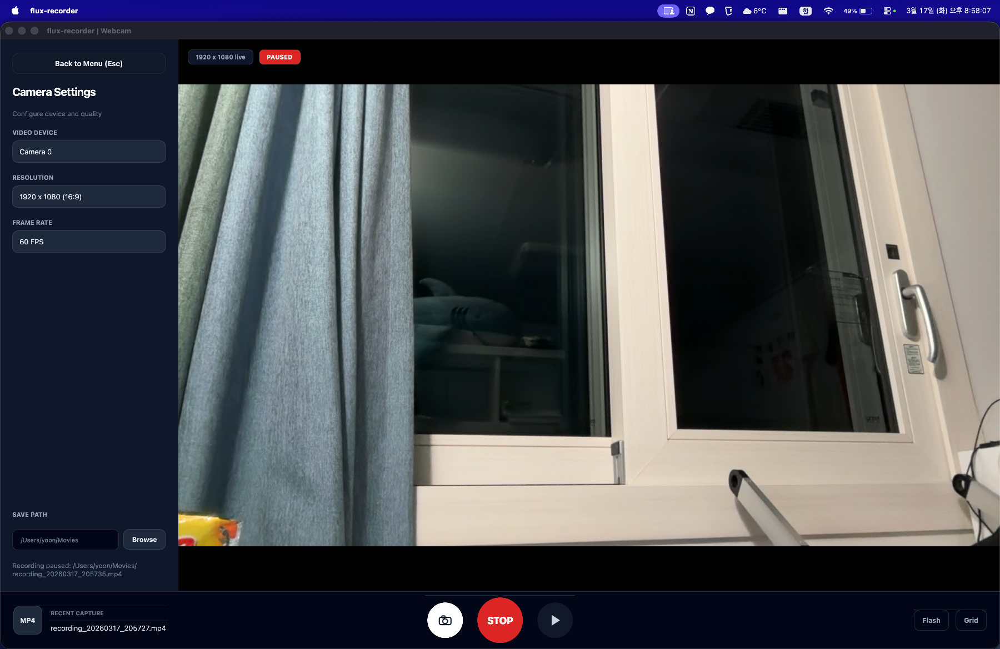

# flux-recorder

`PyQt6`와 `OpenCV`로 만든 데스크톱 미디어 툴킷입니다.

English version: [README.md](README.md)

현재는 크게 세 가지 워크플로우를 포함합니다:
- 웹캠 레코더
  - 사용 가능한 카메라 장치를 스캔하고 감지된 웹캠 사이를 전환
  - 라이브 미리보기와 캡처 상태 배지 표시
  - `PNG` 사진 저장
  - `MP4` 웹캠 녹화
  - 3초 카운트다운 후 녹화 시작
  - 녹화 일시정지, 재개, 정지 제어
  - 플래시와 그리드 오버레이 토글
  - 저장 폴더 선택
- 화면 레코더
  - 전체 데스크톱, 특정 창, 또는 드래그로 지정한 사용자 영역 캡처
  - 캡처 시작 전에 메인 앱 창 숨김
  - 화면 녹화와 스냅샷 저장
  - 프레임 속도 프리셋과 저장 경로 제어
  - UI에서 기본값 복원 지원
  - Windows 창 선택기를 통한 창 캡처 대상 선택
  - 사용자 영역 선택기를 통한 드래그 캡처
  - 메인 창이 숨겨진 동안 플로팅 미니 컨트롤러로 녹화 제어
  - 시스템 오디오와 외부 마이크 토글 UI 제공
  - 현재 제한 사항: OpenCV 녹화 경로에서는 오디오가 실제로 저장되지 않음
- 파일 컨버터
  - 비디오를 `MP4` 또는 `AVI`로 변환
  - 변환 진행률 표시
  - 이미지를 `PNG`, `JPG`, `BMP`, `ICO`로 변환
  - 출력 폴더 선택
  - 원본 크기 유지 또는 사용자 지정 가로, 세로 크기 입력
  - 내보내기 전에 전용 crop 대화상자 열기
  - crop 영역 생성, 이동, 모서리 리사이즈
  - `Free`, `1:1`, `4:5`, `16:9`, `5:4`, `9:16` 비율 프리셋 지원

## 앱 스크린샷

아래 스크린샷은 모두 이 앱의 자체 캡처 기능으로 저장한 이미지입니다.
다만 캡처 순간에는 앱 화면이 잠시 사라지기 때문에, 실제 캡처는 앱을 두 프로세스로 실행한 상태에서 진행했습니다.

### Webcam Recorder

<table>
  <tr>
    <td align="center" width="50%">
      <a href="images/webcam-recorder-default.png"></a><br>
      <sub><strong>Webcam Recorder</strong>: 기본 웹캠 미리보기와 녹화 제어 화면.</sub>
    </td>
    <td align="center" width="50%">
      <a href="images/webcam-recorder-flash.png"></a><br>
      <sub><strong>Webcam Recorder</strong>: 플래시 캡처 흐름이 보이는 화면.</sub>
    </td>
  </tr>
  <tr>
    <td align="center" width="50%">
      <a href="images/webcam-recorder-grid.png"></a><br>
      <sub><strong>Webcam Recorder</strong>: 구도 확인용 그리드 오버레이.</sub>
    </td>
    <td align="center" width="50%">
      <a href="images/webcam-recorder-recording.png"></a><br>
      <sub><strong>Webcam Recorder</strong>: 녹화 중 표시와 상태 배지가 보이는 화면.</sub>
    </td>
  </tr>
  <tr>
    <td align="center" width="50%">
      <a href="images/webcam-recorder-paused.png"></a><br>
      <sub><strong>Webcam Recorder</strong>: 일시정지 상태와 재개 가능한 제어 버튼이 보이는 화면.</sub>
    </td>
    <td></td>
  </tr>
</table>

### Screen Recorder

<table>
  <tr>
    <td align="center" width="50%">
      <a href="images/screen-recorder-overview.png"></a><br>
      <sub><strong>Screen Recorder</strong>: 화면 캡처 설정 작업 공간 개요.</sub>
    </td>
    <td align="center" width="50%">
      <a href="images/screen-recorder-window.png"></a><br>
      <sub><strong>Screen Recorder</strong>: Windows 환경의 창 캡처 모드.</sub>
    </td>
  </tr>
  <tr>
    <td align="center" width="50%">
      <a href="images/screen-recorder-custom.png"></a><br>
      <sub><strong>Screen Recorder</strong>: 사용자 지정 영역 선택 흐름.</sub>
    </td>
    <td></td>
  </tr>
</table>

### File Converter

<table>
  <tr>
    <td align="center" width="50%">
      <a href="images/file-converter-video.png"></a><br>
      <sub><strong>Converter</strong>: 비디오 형식 변환 작업 화면.</sub>
    </td>
    <td align="center" width="50%">
      <a href="images/file-converter-image.png"></a><br>
      <sub><strong>Converter</strong>: 이미지 리사이즈 및 형식 변환 화면.</sub>
    </td>
  </tr>
  <tr>
    <td align="center" width="50%">
      <a href="images/file-converter-crop.png"></a><br>
      <sub><strong>Converter</strong>: 이미지 내보내기 전 crop 대화상자.</sub>
    </td>
    <td></td>
  </tr>
</table>

## 데모 영상

GitHub README에서는 로컬 이미지는 본문에 바로 표시되지만, 로컬 비디오 파일은 링크로 두는 방식이 가장 안정적입니다.

### Webcam Recorder
- [Webcam Recorder 데모 보기](videos/webcam-recorder-total.mov)

### Screen Recorder
- [Screen Recorder 데모 보기](videos/screen-recorder-total.mp4)

### Converter
- [Video Converter 데모 보기](videos/file-converter-video.mp4)
- [Image Converter 데모 보기](videos/file-converter-image.mp4)

## 요구 사항

- Python 3.11+
- 현재 화면 캡처 워크플로우 기준으로 Windows 환경 권장

## 설치

```bash
pip install -r requirements.txt
```

## 실행

```bash
python main.py
```

## 릴리스 빌드 사용

앱을 사용하기 위해 다른 사용자가 직접 `PyInstaller`를 실행할 필요는 없습니다.

- 미리 빌드된 릴리스 파일은 프로젝트의 [Releases](../../releases) 페이지에 올려두었습니다.
- 이 릴리스 파일들은 이 저장소의 `PyInstaller` 패키징 설정으로 만든 결과물입니다.
- Windows에서는 `flux-recorder-windows.zip`를 내려받아 압축을 풀고 `flux-recorder.exe`를 실행하면 됩니다.
- macOS에서는 패키징된 릴리스 파일을 내려받아 포함된 앱 번들을 실행하면 됩니다.
- 패키징된 Windows 앱은 `%APPDATA%\flux-recorder\settings.json`에 설정을 저장합니다.
- macOS에서 처음 실행할 때 시스템 카메라 권한 요청을 허용해야 합니다.


## 핵심 스택

- 데스크톱 UI: `PyQt6`
- 웹캠 캡처, 비디오 저장, 핵심 미디어 처리: `OpenCV`
- 프레임 데이터 처리: `NumPy`
- 이미지 crop 적용, 리사이즈, 형식 변환 작업: `Pillow`

## OpenCV가 코드에서 사용된 위치

이 프로젝트에서 OpenCV는 다음 코드 영역에서 직접 사용됩니다.

- `core/camera.py`
  - `cv2.VideoCapture`로 웹캠 장치를 엽니다.
  - `cv2.CAP_PROP_FPS`로 카메라 FPS를 읽습니다.
  - `cv2.cvtColor`로 프레임을 `BGR`에서 `RGB`로 변환합니다.

```python
class CameraCapture:
    def open(self) -> None:
        self._capture = cv2.VideoCapture(self._device_index)

    @property
    def fps(self) -> float:
        fps = float(self._capture.get(cv2.CAP_PROP_FPS))
        return self._normalize_fps(fps)

def bgr_to_rgb(frame_bgr: np.ndarray) -> np.ndarray:
    return cv2.cvtColor(frame_bgr, cv2.COLOR_BGR2RGB)
```

- `core/recorder.py`
  - `cv2.VideoWriter`로 비디오 writer를 생성합니다.
  - `cv2.VideoWriter_fourcc`로 코덱/FourCC를 선택합니다.
  - 웹캠 녹화와 화면 녹화 프레임을 파일로 저장합니다.

```python
def _open_writer(self, output_path: Path, fps: float, size: tuple[int, int]) -> cv2.VideoWriter | None:
    for fourcc_code in self._fourcc_candidates(output_path.suffix.lower()):
        writer = cv2.VideoWriter(
            str(output_path),
            cv2.VideoWriter_fourcc(*fourcc_code),
            fps,
            size,
        )
        if writer.isOpened():
            return writer
```

- `core/video_converter.py`
  - `cv2.VideoCapture`로 입력 비디오를 엽니다.
  - 프레임 수와 FPS 메타데이터를 읽습니다.
  - 프레임 크기가 다를 때 `cv2.resize`로 맞춥니다.
  - `cv2.VideoWriter`로 변환된 비디오를 저장합니다.
  - 출력 포맷에 따라 여러 FourCC 후보를 시도합니다.

```python
capture = cv2.VideoCapture(str(source))
fps = float(capture.get(cv2.CAP_PROP_FPS))
total_frames = max(0, int(capture.get(cv2.CAP_PROP_FRAME_COUNT)))

while True:
    ok, frame_bgr = capture.read()
    if not ok or frame_bgr is None:
        break
    if frame_bgr.shape[1] != width or frame_bgr.shape[0] != height:
        frame_bgr = cv2.resize(frame_bgr, (width, height), interpolation=cv2.INTER_AREA)
    writer.write(frame_bgr)
```

- `ui/widgets/webcam_page.py`
  - 웹캠 미리보기 시작 과정에서 OpenCV를 사용합니다.
  - `cv2.VideoCapture`로 사용 가능한 카메라 장치를 탐색합니다.
  - Qt UI 표시를 위해 미리보기 프레임을 `BGR`에서 `RGB`로 변환합니다.
  - 운영체제에 따라 `CAP_AVFOUNDATION`, `CAP_DSHOW` 같은 백엔드 상수를 선택합니다.

```python
if self._recording_state == RECORDING and self._recorder is not None:
    self._recorder.write(frame_bgr)

frame_rgb = self._cv2.cvtColor(frame_bgr, self._cv2.COLOR_BGR2RGB)
self.update_frame(frame_rgb)

if backend is None:
    return self._cv2.VideoCapture(device_index)
return self._cv2.VideoCapture(device_index, backend)
```

- `ui/widgets/screen_capture_panel.py`
  - 화면 녹화 결과 처리에 OpenCV를 사용합니다.
  - 캡처된 `RGBA` 이미지를 `cv2.cvtColor`로 `BGR` 프레임으로 변환합니다.
  - 스냅샷 저장 시 `cv2.imwrite`를 사용합니다.

```python
frame_rgba = np.frombuffer(buffer, dtype=np.uint8).reshape((height, width, 4))
return self._cv2.cvtColor(frame_rgba, self._cv2.COLOR_RGBA2BGR)
```

```python
output_path = self._build_snapshot_path()
output_path.parent.mkdir(parents=True, exist_ok=True)
if not self._cv2.imwrite(str(output_path), frame_bgr):
    self.set_status(_screen_text(self._language, "unable_save_snapshot", path=output_path))
    return
```

정리하면 OpenCV는 아래 작업에 사용됩니다.

- 웹캠 장치 접근
- 실시간 프레임 캡처
- 프레임 색상 변환
- FPS 및 메타데이터 읽기
- 비디오 인코딩과 코덱 처리
- 비디오 변환
- 스냅샷 파일 저장

관련 변환기 image crop 흐름:

- `ui/widgets/converter_panel.py`
  - 이미지 변환 흐름에서 crop 다이얼로그를 엽니다.
  - 선택한 crop 영역을 출력 크기, 형식과 함께 변환 요청에 담아 전달합니다.

- `ui/widgets/image_crop_dialog.py`
  - 선택한 이미지를 crop 미리보기 다이얼로그로 보여줍니다.
  - 새 crop 박스를 만들고, 박스를 이동하고, 모서리 핸들로 크기를 조절할 수 있습니다.
  - `1:1`, `4:5`, `16:9`, `5:4`, `9:16` 고정 비율을 지원합니다.
  - 미리보기 크기와 선택한 crop 영역 크기를 픽셀 단위로 표시합니다.

- `core/image_converter.py`
  - 먼저 crop 영역을 적용합니다.
  - 너비와 높이가 지정되어 있으면 crop 결과를 다시 리사이즈합니다.
  - 마지막으로 선택한 이미지 형식으로 저장합니다.

```python
if image_crop is not None:
    image = _apply_crop(image, image_crop)

if image_size is not None:
    image = image.resize((width, height), Image.Resampling.LANCZOS)
```

참고:

- `core/image_converter.py`는 `Pillow`를 사용해 이미지 crop, 내보내기, 리사이징을 처리합니다.
- OpenCV 사용 비중이 큰 경로는 웹캠 캡처, 화면 녹화, 비디오 변환입니다.
- crop UI는 변환기 워크플로우에 포함되어 있지만, 최종 이미지 crop/export 경로는 현재 OpenCV가 아니라 `PyQt6` + `Pillow`로 처리합니다.

## 윈도우 캡처 관련 참고

`Window` 캡처는 모든 종류의 앱에서 동일하게 안정적으로 동작하지는 않습니다.

- 파일 탐색기, 메모장 같은 일반 데스크톱 창은 비교적 잘 동작합니다.
- Chrome, 게임, 일부 미디어 플레이어처럼 하드웨어 가속을 사용하는 창은 검은 화면, 멈춘 프레임, 오래된 프레임이 보일 수 있습니다.
- 이는 GPU로 렌더링되는 창이 `grabWindow`, `PrintWindow` 같은 전통적인 `HWND` 캡처 경로에서 최신 화면 내용을 제대로 제공하지 않는 경우가 있기 때문입니다.

## 권장 우회 방법

- Chrome 창이 검게 보이면 하드웨어 가속을 꺼서 테스트해보세요.
- 게임이나 GPU 사용량이 높은 앱은 `Window` 대신 `Full Screen` 또는 `Custom` 캡처를 사용하는 편이 좋습니다.
- 게임이나 가속 앱에 대해 정확한 창 단위 캡처가 꼭 필요하다면 `Windows Graphics Capture` 같은 다른 Windows 전용 백엔드가 필요합니다.

## 현재 제한 사항

- 현재 화면 녹화 경로는 비디오 출력에 `OpenCV`를 사용하며, 오디오 녹음은 완전히 지원하지 않습니다.
- `Window` 캡처에서는 녹화 중 대상 창 크기 변경을 지원하지 않습니다.
- 일부 하드웨어 가속 창은 올바르게 선택해도 여전히 캡처에 실패할 수 있습니다.

## 향후 업데이트 계획

- 이미지 컨버터를 더 강화해, 하나의 `PNG` 원본으로부터 전체 `ICO`, `ICNS` 아이콘 세트를 생성하는 흐름을 추가할 예정입니다.
- 아이콘 변환 시 `16x16`, `32x32`, `48x48`, `64x64`, `128x128`, `256x256` 같은 표준 크기를 자동으로 함께 생성하도록 확장할 계획입니다.
- crop과 resize 이후에도 이미지 품질이 더 안정적으로 유지되도록 변환 파이프라인을 개선하고, 눈에 띄는 화질 저하를 줄이는 방향으로 보강할 예정입니다.
- 녹화 기능에는 `OpenCV` 외의 추가 미디어 라이브러리를 활용해 오디오를 함께 수집하고, 이후 비디오와 결합하는 방향을 검토하고 있습니다.
