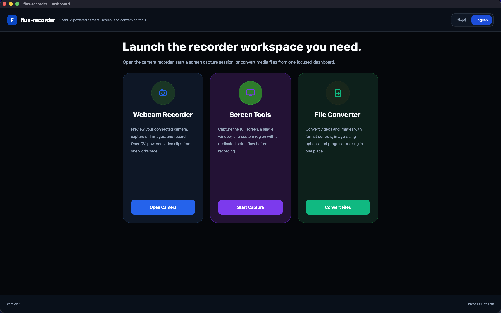

# flux-recorder

`PyQt6`와 `OpenCV`로 만든 데스크톱 미디어 툴킷입니다.

English version: [README.md](README.md)

현재 포함된 기능:
- 웹캠 녹화
- 화면 녹화
- 이미지 및 비디오 변환

## 앱 스크린샷

실행 화면 스크린샷은 `images/` 폴더에 넣고, 최종 제출 전에 아래 placeholder를 실제 경로로 교체하면 됩니다.

권장 파일명:

- `images/dashboard.png`
- `images/webcam-recorder.png`
- `images/screen-recorder.png`
- `images/file-converter.png`

권장 마크다운:

```md



```

## 데모 영상

데모 영상은 GitHub, YouTube, 또는 클라우드 저장소에 올린 뒤 최종 링크를 이 섹션에 넣으면 됩니다.

저장소 안에 같이 둘 경우 권장 파일명:

- `videos/flux-recorder-demo.mp4`

권장 마크다운:

```md
[데모 영상 보기](videos/flux-recorder-demo.mp4)
```

## 요구 사항

- Python 3.11+
- 현재 화면 캡처 워크플로우 기준으로 Windows 환경 권장

## 설치

```bash
pip install -r requirements.txt
```

## 실행

```bash
python main.py
```

## PyInstaller로 패키징

빌드는 대상 운영체제별로 각각 진행해야 합니다.

- Windows 빌드는 Windows에서
- macOS 빌드는 macOS에서

먼저 PyInstaller를 설치합니다.

```bash
pip install pyinstaller
```

Windows:

```bash
build\build_windows.bat
```

macOS:

```bash
bash build/build_mac.sh
```

빌드 결과물은 `dist/flux-recorder/`에 생성됩니다.

참고:

- 패키징에는 `flux-recorder.spec`를 사용합니다.
- `assets/` 폴더는 자동으로 번들됩니다.
- Windows 앱 아이콘은 `assets/app.ico`를 사용합니다.
- macOS 앱 아이콘은 `assets/app.icns`를 추가하면 사용됩니다. `.icns`가 없어도 빌드는 가능합니다.

## 핵심 스택

- 데스크톱 UI: `PyQt6`
- 웹캠 캡처, 비디오 저장, 핵심 미디어 처리: `OpenCV`
- 프레임 데이터 처리: `NumPy`
- 일부 이미지 변환 작업: `Pillow`

## OpenCV가 코드에서 사용된 위치

이 프로젝트에서 OpenCV는 다음 코드 영역에서 직접 사용됩니다.

- `core/camera.py`
  - `cv2.VideoCapture`로 웹캠 장치를 엽니다.
  - `cv2.CAP_PROP_FPS`로 카메라 FPS를 읽습니다.
  - `cv2.cvtColor`로 프레임을 `BGR`에서 `RGB`로 변환합니다.

```python
class CameraCapture:
    def open(self) -> None:
        self._capture = cv2.VideoCapture(self._device_index)

    @property
    def fps(self) -> float:
        fps = float(self._capture.get(cv2.CAP_PROP_FPS))
        return self._normalize_fps(fps)

def bgr_to_rgb(frame_bgr: np.ndarray) -> np.ndarray:
    return cv2.cvtColor(frame_bgr, cv2.COLOR_BGR2RGB)
```

- `core/recorder.py`
  - `cv2.VideoWriter`로 비디오 writer를 생성합니다.
  - `cv2.VideoWriter_fourcc`로 코덱/FourCC를 선택합니다.
  - 웹캠 녹화와 화면 녹화 프레임을 파일로 저장합니다.

```python
def _open_writer(self, output_path: Path, fps: float, size: tuple[int, int]) -> cv2.VideoWriter | None:
    for fourcc_code in self._fourcc_candidates(output_path.suffix.lower()):
        writer = cv2.VideoWriter(
            str(output_path),
            cv2.VideoWriter_fourcc(*fourcc_code),
            fps,
            size,
        )
        if writer.isOpened():
            return writer
```

- `core/video_converter.py`
  - `cv2.VideoCapture`로 입력 비디오를 엽니다.
  - 프레임 수와 FPS 메타데이터를 읽습니다.
  - 프레임 크기가 다를 때 `cv2.resize`로 맞춥니다.
  - `cv2.VideoWriter`로 변환된 비디오를 저장합니다.
  - 출력 포맷에 따라 여러 FourCC 후보를 시도합니다.

```python
capture = cv2.VideoCapture(str(source))
fps = float(capture.get(cv2.CAP_PROP_FPS))
total_frames = max(0, int(capture.get(cv2.CAP_PROP_FRAME_COUNT)))

while True:
    ok, frame_bgr = capture.read()
    if not ok or frame_bgr is None:
        break
    if frame_bgr.shape[1] != width or frame_bgr.shape[0] != height:
        frame_bgr = cv2.resize(frame_bgr, (width, height), interpolation=cv2.INTER_AREA)
    writer.write(frame_bgr)
```

- `ui/widgets/webcam_page.py`
  - 웹캠 미리보기 시작 과정에서 OpenCV를 사용합니다.
  - `cv2.VideoCapture`로 사용 가능한 카메라 장치를 탐색합니다.
  - Qt UI 표시를 위해 미리보기 프레임을 `BGR`에서 `RGB`로 변환합니다.
  - 운영체제에 따라 `CAP_AVFOUNDATION`, `CAP_DSHOW` 같은 백엔드 상수를 선택합니다.

```python
if self._recording_state == RECORDING and self._recorder is not None:
    self._recorder.write(frame_bgr)

frame_rgb = self._cv2.cvtColor(frame_bgr, self._cv2.COLOR_BGR2RGB)
self.update_frame(frame_rgb)

if backend is None:
    return self._cv2.VideoCapture(device_index)
return self._cv2.VideoCapture(device_index, backend)
```

- `ui/widgets/screen_capture_panel.py`
  - 화면 녹화 결과 처리에 OpenCV를 사용합니다.
  - 캡처된 `RGBA` 이미지를 `cv2.cvtColor`로 `BGR` 프레임으로 변환합니다.
  - 스냅샷 저장 시 `cv2.imwrite`를 사용합니다.

```python
frame_rgba = np.frombuffer(buffer, dtype=np.uint8).reshape((height, width, 4))
return self._cv2.cvtColor(frame_rgba, self._cv2.COLOR_RGBA2BGR)
```

```python
output_path = self._build_snapshot_path()
output_path.parent.mkdir(parents=True, exist_ok=True)
if not self._cv2.imwrite(str(output_path), frame_bgr):
    self.set_status(_screen_text(self._language, "unable_save_snapshot", path=output_path))
    return
```

정리하면 OpenCV는 아래 작업에 사용됩니다.

- 웹캠 장치 접근
- 실시간 프레임 캡처
- 프레임 색상 변환
- FPS 및 메타데이터 읽기
- 비디오 인코딩과 코덱 처리
- 비디오 변환
- 스냅샷 파일 저장

참고:

- `core/image_converter.py`는 주로 `Pillow`를 사용해 이미지 내보내기와 리사이징을 처리합니다.
- OpenCV 사용 비중이 큰 경로는 웹캠 캡처, 화면 녹화, 비디오 변환입니다.

## 윈도우 캡처 관련 참고

`Window` 캡처는 모든 종류의 앱에서 동일하게 안정적으로 동작하지는 않습니다.

- 파일 탐색기, 메모장 같은 일반 데스크톱 창은 비교적 잘 동작합니다.
- Chrome, 게임, 일부 미디어 플레이어처럼 하드웨어 가속을 사용하는 창은 검은 화면, 멈춘 프레임, 오래된 프레임이 보일 수 있습니다.
- 이는 GPU로 렌더링되는 창이 `grabWindow`, `PrintWindow` 같은 전통적인 `HWND` 캡처 경로에서 최신 화면 내용을 제대로 제공하지 않는 경우가 있기 때문입니다.

## 권장 우회 방법

- Chrome 창이 검게 보이면 하드웨어 가속을 꺼서 테스트해보세요.
- 게임이나 GPU 사용량이 높은 앱은 `Window` 대신 `Full Screen` 또는 `Custom` 캡처를 사용하는 편이 좋습니다.
- 게임이나 가속 앱에 대해 정확한 창 단위 캡처가 꼭 필요하다면 `Windows Graphics Capture` 같은 다른 Windows 전용 백엔드가 필요합니다.

## 현재 제한 사항

- 현재 화면 녹화 경로는 비디오 출력에 `OpenCV`를 사용하며, 오디오 녹음은 완전히 지원하지 않습니다.
- `Window` 캡처에서는 녹화 중 대상 창 크기 변경을 지원하지 않습니다.
- 일부 하드웨어 가속 창은 올바르게 선택해도 여전히 캡처에 실패할 수 있습니다.
